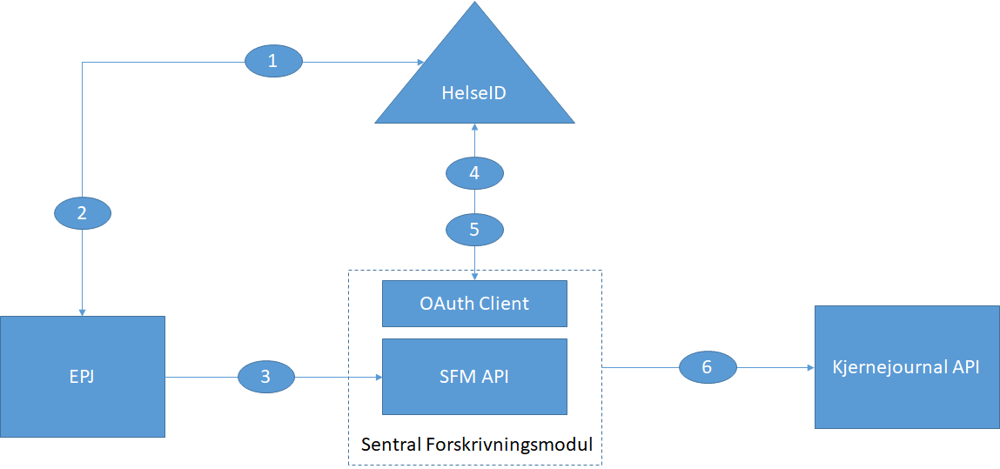

.. _h303d77b173d1b78f593737693d2365:

Profil for Token Exchange i HelseID v1.0
########################################

| `Introduksjon <#h253d315c5d9115655f774b60161b6d>`_
| `Sentrale begreper <#h64232c222b5772471e56675a224c677a>`_
| `Konfigurasjon av Token Exchange i HelseID <#h2f4585d15234d33684618344c275b76>`_
|     `Actor client <#h2f7a4c3507626713426e79691783>`_
|     `Subject client <#h17764c5f4c7c4a193943384f3c97079>`_
| `Protokollflyt <#h307b29862294f765634e366756818>`_
|     `Beskrivelse av overordnet flyt <#h68285a545b3825132f501c4e29252a38>`_
|     `Forespørsel til token-endepunkt <#h256191d493e3f175830412a42111651>`_
|         `Eksempel <#h4b5216465d28376a604243715216561b>`_
|     `Respons ved suksess <#h792a2e384336293e5375a1872587245>`_
|     `Respons i feilsituasjoner <#h202e3cd2d76756452d23332a3532c>`_
|         `Feil i validering av subject_token <#h5483c7062552f20794915877265827>`_
|         `Actor client mangler rettigheter <#h43d663e7322224f40764c1a81b6d56>`_
|         `Actor client spør om for brede tillatelser <#h56275d35692622a30737b7a28d291e>`_
|         `Actor client forsøker å utveksle et token som allerede er utvekslet for mange ganger <#he3b4d3a4ad737a1d34767394fc5d>`_
|         `Actor client tilhører en annen Configuration Owner enn “aud” (API ressurs) i subject token. <#h705724742638295848474f6b37354922>`_
| `Client Assertion fra actor client <#h22a3555655d1237b3d4c74f474166>`_
|     `Støtta påstander fra klient <#h9321971572d22592c74244c726409>`_
|     `Signeringsnøkkel <#h30216673803b637b142f471664b1d41>`_
|         `Virksomhetssertifikat <#h624962202f15113d6e3b5c102b394025>`_
|         `Nøkkelpar <#ha5a466952795d57674757776823a70>`_
|         `Eksempel på client assertion <#h2a621c1d27442e186754c76700273f>`_
| `Token Exchange token (te_token) <#h706c416f251264769383b392395c63>`_
|     `Claims kopiert fra subject_token <#h80304848414314263d513c37a3f5c5e>`_
|         `Om client_id <#h28294e3b711b81422214a5168223f4c>`_
|     `Standard jwt-claims <#h1637557c2686e5c7f534a75f284427>`_
|     `Actor claim <#h19383d3e311386b49653765122949>`_
|     `Eksempel <#h4b5216465d28376a604243715216561b>`_
| `Dynamic Client Registration i HelseID <#h7bf22931575d39732a6923a4d5219>`_
| `Eksempler <#h143c3476836169a6231772e721132>`_

.. _h2c1d74277104e41780968148427e:

.. _h253d315c5d9115655f774b60161b6d:

Introduksjon
************

\ |LINK1|\  (fra nå “TE”) er en snart ferdigstilt spesifikasjon fra IETF som beskriver en protokoll for å hente ut sikkerhetsbilletter fra en STS for “impersonation” og “delegation”. Se spesifikasjonen for beskrivelse av disse begrepene.

For HelseID er denne spesifikasjonen interessant for brukstilfeller hvor bakenforliggende tjenester - i hovedsak REST API-er - skal kalle andre tjenester på vegne av en autentisert person.

.. _h2e5730f1e713135e7723569783571:

Sentrale begreper 
******************

I forbindelse med token exchange innføres det noen nye roller for klienter og tokens. For å kunne diskutere disse entydig i dokumentet, følger definisjoner under.

subject_token 

    et access token utstedt av HelseID hvor det er inkludert claims om autentisert person og virksomhet hvor dette (tokenet) skal veksles inn ved bruk av TE. 

te_token

    et access token som utleveres av HelseID i forbindelse med TE. Et te_token vil alltid inneholde et claim med type act. Med andre ord vil et token utstedt av HelseID som inneholder et  act claim alltid være et resultat av en token exchange flyt. I tillegg vil et te_token alltid inneholde claimet helseid://claims/client/original_client_id.

subject client 

    klient (med tilhørende konfigurasjonen i HelseID) som er mottaker av et subject_token.

actor client 

    en klient som ønsker å utveksle et subject_token for et te_token.

.. _h2f4585d15234d33684618344c275b76:

Konfigurasjon av Token Exchange i HelseID
*****************************************

Konfigurasjon av TE krever oppsett av en actor client. I tillegg må det konfigureres for hvilke subject clients den kan utveksle på vegne av. Dette gjøres per subject client.

.. _h2f7a4c3507626713426e79691783:

Actor client
============

Oppsett av en actor client i HelseID krever følgende:

* grant_type settes til "urn:ietf:params:oauth:grant-type:token-exchange". Kan kombineres med “client_credentials”

* secret må settes, og kan være en av følgende

    * virksomhetssertifikat

    * RSA nøkkel.

* scopes til API-er som skal konsumeres.

.. _h17764c5f4c7c4a193943384f3c97079:

Subject client
==============

For en subject client må det indikeres hvilke actor clients som kan veksle inn tokens fra denne klienten. Det kreves følgende:

* “\ |STYLE0|\ ” settes til en eller flere klienter som kan opptre som actor clients.

* Dersom klientkonfigurasjonen er en DCR client, vil listen over gjelde for alle klienter opprettet av denne.

.. _h307b29862294f765634e366756818:

Protokollflyt
*************

Protokollflyten i Token Exchange består av et kall mot token-endepunktet i HelseID. Dette kallet inkluderer en ny verdi for parameteret grant_type og nye parametere for å sende inn subject_token som skal utveksles. I retur sendes enten utvekslet te_token eller en feilmelding.

.. _h68285a545b3825132f501c4e29252a38:

Beskrivelse av overordnet flyt
==============================

Flyten beskriver et kall til SFM API fra EPJ med innbytte av token som kan brukes mot Kjernejournal.

\ |IMG1|\ 

\ |STYLE1|\ 

	EPJ = Subject Client

    AT#1 = Subject Token

    OAuth Client til SFM = Actor Client

    AT#2 = TE_Token

#. EPJ forespør autentisering av bruker og ber om tilgang til SFM API

#. HelseID utsteder Access Token (AT#1) med person- og virksomhetsinformasjon

#. EPJ kaller SFM API, og legger ved AT#1 i Authorization header i forespørselen

#. SFM gjør en forespørsel mot HelseID om tilgang til API 2 ved bruk av token exchange flyt mot token-endepunktet. SFM legger ved AT#1 som \ |STYLE2|\  parameter i forespørselen

#. HelseID utsteder et nytt access token (AT#2) som utgjør \ |STYLE3|\ , og returnerer dette til SFM. AT#2 innholder bruker- og virksomhetsinformasjon fra AT#1, samt informasjon om SFM (klient).

#. SFM kaller Kjernejournal API, og legger ved AT#2 i Authorization header i forespørselen

.. _h256191d493e3f175830412a42111651:

Forespørsel til token-endepunkt
===============================

TE kall til token endepunktet fra actor client skal inneholde følgende parametre.

grant_type 

	alltid urn:ietf:params:oauth:grant-type:token-exchange.

scope

	API resource scopes som ønskes. Separer scopes med mellomrom (“ “).

subject_token

	access token utstedt av HelseID som skal utveksles.

subject_token_type

	alltid urn:ietf:params:oauth:token-type:access_token.

client_assertion

	en base64-kodet signert jwt i henhold til \ |LINK2|\  med med mulighet til å sende ekstra påstander fra klienten. Skal ligge i body til request. Se \ |LINK3|\ . En client_assertion vil blant annet inneholde client_id.

client_assertion_type

	alltid urn:ietf:params:oauth:client-assertion-type:jwt-bearer. Skal ligge i body til request. 

Alle parametre MÅ sendes i body som en del av en POST-request.

.. _h4b5216465d28376a604243715216561b:

Eksempel
--------

POST /connect/token
	client_id=client1&

	client_assertion=[base64 enkodet jwt]&

    client_assertion_type=urn:ietf:params:oauth:client-assertion-type:jwt-bearer&

	scope=api1 api2&

    subject_token=[base64 enkodet access token]&

    subject_token_type=urn:ietf:params:oauth:token-type:access_token&

    grant_type=urn:ietf:params:oauth:grant-type:token-exchange

(Enkoding er fjernet og linjeskift lagt til for lesbarhet)

.. _h792a2e384336293e5375a1872587245:

Respons ved suksess
===================

Ved en vellykket forespørsel er responsen som indikert i \ |LINK4|\ . For HelseID gjelder følgende.

access_token

    streng 

    returnert base64 enkodet te_token som beskrevet i \ |LINK5|\ . 

issued_token_type 

    streng

    alltid "urn:ietf:params:oauth:token-type:access_token".

token_type

    streng

    alltid "Bearer".

expires_in

    nummer 

    levetidi sekunder for returnert token.

\ |STYLE4|\ 

.. _h202e3cd2d76756452d23332a3532c:

Respons i feilsituasjoner
=========================

Ved feilsituasjoner vil HelseID returnere en JSON-serialisert struktur som beskrevet i \ |LINK6|\ , altså på formatet

{ 

	error: “...”,

	error_description: “...”

} 

De følgende feilsituasjonene er spesifikke for token exchange.

.. _h5483c7062552f20794915877265827:

Feil i validering av subject_token
----------------------------------

Dette inkluderer at token ikke er utstedt av HelseID, det har utgått og annet

error

    "invalid_request"

error_description

    "invalid subject_token - [detaljert informasjon]"

.. _h43d663e7322224f40764c1a81b6d56:

Actor client mangler rettigheter
--------------------------------

Denne situasjonen oppstår dersom subject klient ikke er konfigurert til å tillate token exchange for subject client. Se [lenke til konfigurasjon].

error

    "invalid_request"

error_description

    "not permitted" 

.. _h56275d35692622a30737b7a28d291e:

Actor client spør om for brede tillatelser
------------------------------------------

Dette oppstår dersom klienten spør om scopes som går på tvers av API-ressurser.

error

    "invalid_target"

error_description

    "invalid scopes requested"

\ |STYLE5|\ .

.. _he3b4d3a4ad737a1d34767394fc5d:

Actor client forsøker å utveksle et token som allerede er utvekslet for mange ganger
------------------------------------------------------------------------------------

error

    "invalid_request"

error_description

    "subject_token exchanged too many times ([maks_nummer_her])"

.. _h705724742638295848474f6b37354922:

Actor client tilhører en annen Configuration Owner enn “aud” (API ressurs) i subject token.
-------------------------------------------------------------------------------------------

error

    "invalid_request"

error_description

    "no audience matching configuration owner of client_id [client_id] was found in subject token"

.. _h22a3555655d1237b3d4c74f474166:

Client Assertion fra actor client
*********************************

En client assertion er en standard jwt som er bygd opp i henhold til \ |LINK7|\ . Den skal være signert med klientens hemmelighet i HelseID og skal inneholde følgende claims:

iss

    streng

    client_id til actor client

sub

    streng

    client_id til actor client

aud 

    streng 

    HelseID token-endepunt , f.eks "\ |LINK8|\ ". Må være lik claimet iss i subject_token.

exp

    nummer

    tidspunkt client assertion utløper i epoch tid (sekunder siden 1970.01.01).

iat 

    nummer

    tidspunkt for utstedelse i epoch tid. Kan ikke være lengre tilbake i tid enn 120 sekunder.

	

.. _h9321971572d22592c74244c726409:

Støtta påstander fra klient
===========================

I tillegg til de påkrevde claimene over, støtter HelseID påstander knyttet til identiteten til actor client-en, spesifikt virksomheten som klienten opererer under. Merk at disse påstandene er viker for informasjonen HelseID henter ut fra virksomhetssertifikat dersom et slikt benyttes som hemmelighet.

Påstandene under vil reflekteres i utstedt te_token under act claimet.

helseid://client/claims/orgnr_parent

	streng

	overordnet organisasjonsnummer for actor client.

	

helseid://client/claims/orgnr_parent_description

	streng, maks 100 tegn.

	beskrivelse av organisasjonsnummer. 

helseid://client/claims/orgnr_child

	streng

	beskrivelse av organisasjonsnummer. 

helseid://client/claims/orgnr_child_description

	streng, maks 100 tegn. 

	underordnet organisasjonsnummer for actor client.

.. _h30216673803b637b142f471664b1d41:

Signeringsnøkkel
================

HelseID støtter client assertions signert med virksomhetssertifikater ifm klientautentisering for token echange.

.. _h624962202f15113d6e3b5c102b394025:

Virksomhetssertifikat
---------------------

Ved bruk av virksomhetssertifikat vil følgende claims inkluderes i te_token under actor claimet:

helseid://claims/client/ec/exp

	nummer

	utløpsdato til sertifikat, epoch tid i sekunder 

helseid://claims/client/ec/orgnr_parent

	streng

	organisasjonsnummer oppgitt i virksomhetssertifikat

helseid://claims/client/ec/orgnr_child

	streng

	under-organisasjonsnummer oppgitt i virksomhetssertifikat

Dersom claimene for organisasjonsnummer blir satt, vil de også reflekteres i tilsvarende claims under navnerommet helseid://client/claims/. Dette vil overstyre  eventuelle innkommende påstander beskrevet i forrige kapittel.

.. _ha5a466952795d57674757776823a70:

Nøkkelpar
---------

Støtte for RSA-nøkkelpar som hemmelighet er ikke støttet i nåværende implementasjon. 

.. _h2a621c1d27442e186754c76700273f:

Eksempel på client assertion
----------------------------

{..standard jwks ihht rfc7517}

.

{

"exp":1541635665,

"iat":"1541635665",

"iss":"c26a87dd-b875-412a-a30b-4b487f141153",

"sub":"c26a87dd-b875-412a-a30b-4b487f141153",

"aud":"https://helseid-sts.test.nhn.no/connect/token"

"helseid://client/claims/orgnr_child":"912159523",

"helseid://client/claims/orgnr_description":"UDELT AS"

}

.	

{..signatur...}

.. _h706c416f251264769383b392395c63:

Token Exchange token (te_token)
*******************************

Et te_token er et normalt access token som består av følgende deler:

* Claims kopiert fra subject_token på toppnivå.

* Påkrevde claims på toppnivå - ikke fra subject_token.

* Actor. Et claim som inneholder informasjon om nåværende og tidligere actors.

.. _h80304848414314263d513c37a3f5c5e:

Claims kopiert fra subject_token
================================

* alle claims med prefiks "helseid://\*"

* sub: HelseID-spesifikk id for autentisert bruker

* idp: IDP som ble brukt ifm brukerautentisering

* amr: Påloggingsmetode i IDP som ble brukt ifm brukerautentisering

* auth_time: tidspunkt bruker ble autentisert.

.. _h28294e3b711b81422214a5168223f4c:

Om client_id
------------

I tokenet vil client_id indikere client_id til actor client. For å kunne identifisere opprinnelig client_id fra en subject token som ikke allerede har blitt utvekslet med token exchange, kopieres denne inn i et egen claim.

* helseid://claims/client/original_client_id: client_id til det initielle autentiserte access tokenet som ble utstedt av HelseID uten bruk av token exchange.	

.. _h1637557c2686e5c7f534a75f284427:

Standard jwt-claims
===================

* nbf

* exp

* iss

* aud

* client_id

* scope

* jti

.. _h5d9713f406c71653c23672a2b5cc5c:

Actor claim 
============

Dette claimet, act, er bygd opp som \ |LINK9|\ . 

Et actor claim består av et sett av claims som identifiserer virksomhet og klient som opptrer på vegne av autentisert person. 

For kallkjeder hvor token exchange benyttes flere ganger støttes nesta strukturer med actor claims. I en slik struktur er innerste actor er den eldste og ytterste den nyeste og aktive actor.

Et act claim er bygd opp som følger

iss

	HelseID authority som har identifisert actor

client_id

	Identifikator for actor client

helseid://claims/client/claims/orgnr_parent

	Organisasjonsnummer for toppnivå-virksomhet. Kilde er enten virksomhetssertifikat eller påstand i client assertion som er brukt som hemmelighet.

helseid://claims/client/claims/orgnr_parent_description

	Beskrivelse av organisasjonsnummer for toppnivå-virksomhet. Kilde er påstand i client assertion som er brukt som hemmelighet.

helseid://claims/client/claims/orgnr_child

	Organisasjonsnummer for undervirksomhet. Kilde er enten virksomhetssertifikat eller påstand i client assertion som er brukt som hemmelighet.

helseid://claims/client/claims/orgnr_parent_description

	Beskrivelse av organisasjonsnummer for undervirksomhet. Kilde er påstand i client assertion som er brukt som hemmelighet.

helseid://claims/client/ec/orgnr_parent 

	Organisasjonsnummer for toppnivå-virksomhet. Kilde er virksomhetssertifikat. Claimet er bare tilstede dersom virksomhetssertifikat er brukt for å signere hemmelighet.

helseid://claims/client/ec/orgnr_child 

	Organisasjonsnummer for undervirksomhet. Kilde er virksomhetssertifikat. Claimet er bare tilstede dersom virksomhetssertifikat er brukt for å signere hemmelighet.

helseid://claims/client/ec/exp 

	Utløpsdato for virksomhetssertifikat dersom brukt for å signere hemmelighet.

.. _h4b5216465d28376a604243715216561b:

Eksempel
========

{

  "nbf": 1534843469,

  "exp": 1534847069,

  "iss": "https://helseid-sts.test.nhn.no",

  "aud": [

    "https://helseid-sts.test.nhn.no/resources",

    "e-helse:api_2"

  ],

  "client_id": "client_subject_1",

  "sub": "MFxFbZkwEzDCInDoQyYqLkGRa2pcIpFN/fAekSK9kj8=",

  "auth_time": 1534843469,

  "idp": "id-porten-oidc",

  "amr": [

    "bankid"

  ],

  "helseid://claims/identity/security_level": "4",

  "helseid://claims/identity/pid": "24019391117",

  "helseid://claims/hpr/hpr_number": "565464684",

  "jti": "8c6d848b4aee50d6b90c1b5e406fbc99",

  "scope": [

    "e-helse/api_2:read"

  ],

  "act": {

    "iss": "https://helseid-sts.test.nhn.no",

    "client_id": "client_actor_2"

  	"helseid://claims/client/claims/orgnr_parent" : "915933149"

  	"helseid://claims/client/ec/orgnr_parent" : "915933149"

  	"helseid://claims/client/ec/exp" : "1571918333"

	“act”: {

		…[actor claims fra tidligere kall..]...

    }

  }

}

.. _h1176b4e7e4b554d11103d860747a69:

Selvbetjenings API
******************

Token Exchange er ikke tillatt som en lovlig flyt ifm klienter opprettet med selvbetjenings API-et.

.. _h143c3476836169a6231772e721132:

Eksempler
*********

Eksempelkode for bruk av token exchange er tilgjengelig her:

\ |LINK10|\ 

.. bottom of content

.. |STYLE0| replace:: *allowed token exchange clients*

.. |STYLE1| replace:: **Forklaring:**

.. |STYLE2| replace:: *subject_token*

.. |STYLE3| replace:: *te_token*

.. |STYLE4| replace:: **[Eksempel på respons her]**

.. |STYLE5| replace:: **Denne sjekken er ikke implementert - konsekvenser for forvaltning må vurderes først**

.. |LINK1| raw:: html

    <a href="https://datatracker.ietf.org/doc/draft-ietf-oauth-token-exchange/" target="_blank">Token Exchange for OAuth2</a>

.. |LINK2| raw:: html

    <a href="https://tools.ietf.org/html/rfc7523" target="_blank">rfc 7523</a>

.. |LINK3| raw:: html

    <a href="#heading=h.bdi47zjamgmd">Client Assertion fra actor client</a>

.. |LINK4| raw:: html

    <a href="https://tools.ietf.org/html/draft-ietf-oauth-token-exchange-16#section-2.2.1" target="_blank">spesifikasjonen</a>

.. |LINK5| raw:: html

    <a href="#heading=h.p275dm88b61w">Token Exchange token (te_token)</a>

.. |LINK6| raw:: html

    <a href="https://tools.ietf.org/html/rfc6749#section-5.2 " target="_blank">rfc 6749</a>

.. |LINK7| raw:: html

    <a href="https://tools.ietf.org/html/rfc7523" target="_blank">rfc 7523</a>

.. |LINK8| raw:: html

    <a href="https://helseid-sts.nhn.no/connect/token" target="_blank">https://helseid-sts.nhn.no/connect/token</a>

.. |LINK9| raw:: html

    <a href="https://tools.ietf.org/html/draft-ietf-oauth-token-exchange-16#section-4.1" target="_blank">spesifisert her</a>

.. |LINK10| raw:: html

    <a href="https://github.com/HelseID/HelseID.Samples/tree/master/HelseId.Clients.TokenExchange" target="_blank">https://github.com/HelseID/HelseID.Samples/tree/master/HelseId.Clients.TokenExchange</a>

